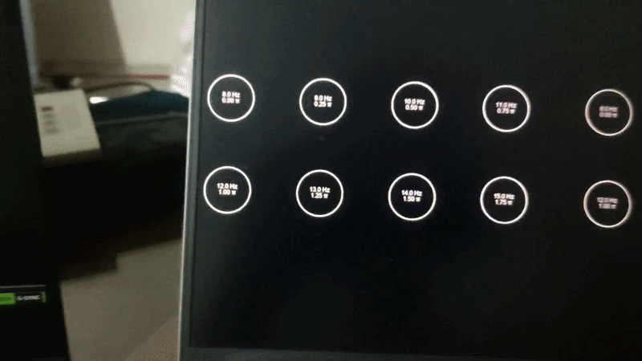

# Binocular SSVEP Stimulation Suite & Display Timing Verification

[](https://www.mathworks.com/products/matlab.html)
[](http://psychtoolbox.org/)
[]()

A MATLAB and Psychtoolbox-3 experimental suite designed to deliver dichoptic, binocularly coded Steady-State Visually Evoked Potential (SSVEP) stimulation and quantitative display timing verification on conventional monitors.

This project replicates and adapts the experimental paradigm from the AR-SSVEP benchmark (*Ke et al., 2025*, Scientific Data), translating dichoptic stimulation from head-mounted AR glasses into a side-by-side stereoscopic paradigm on standard displays. Developed as part of the **Brain Physiology and Cognition** curriculum at Amirkabir University of Technology (Tehran Polytechnic).

---

## Stimulus Execution Demo



*Side-by-side 2×4 binocular stimulation with pre-trial parameter legend preview.*

---

## Experimental Design

The stimulation design and condition structures replicate the benchmark established by Ke et al. (2025):


*Figure adapted from Ke et al. (2025), Scientific Data.*

* **Experiment 1 (Congruent)**: Low-frequency (LF: 8–15 Hz) and medium-frequency (MF: 23–30 Hz) targets with matching frequency and phase across both eyes (SFSP).
* **Experiment 2 (Phase & Frequency Incongruency)**: Investigates interocular rivalry and combination through Same Frequency Different Phase (SFDP), Different Frequency Same Phase (DFSP), and Different Frequency Different Phase (DFDP) conditions.
* **Experiment 3 (Graded Disparity)**: DFDP conditions evaluated across 1 Hz, 3 Hz, and 5 Hz frequency disparities between the eyes.

---

## Key Features

* **Side-by-Side Dichoptic Presentation**: Splits display output into two calibrated visual halves, simulating independent dual-channel visual input without requiring specialized AR/VR hardware.
* **Waveform Modulation Comparison**: Uses 50% duty-cycle square waves ($L(t) = 0.5 \cdot [1 + \text{sign}(\sin(2\pi f t + \phi\pi))]$) to enhance SSVEP response amplitudes, while providing test routines comparing sine, triangle, and square waveforms.
* **4-Way Timing & Frequency Verification**: Validates physical screen flicker against requested nominal targets using four independent routines:
  1. **FFT Peak**: Dominant harmonic identification via resampled spectral analysis.
  2. **Zero-Crossing Rate**: Direct cycle-duration calculation via sub-sample linear interpolation.
  3. **Autocorrelation Lag**: Period identification from fundamental lag peaks in $R_{xx}(\tau)$.
  4. **Direct Frame-Timing**: Frame-rate drift tracking based solely on vertical refresh timestamps ($f_{\text{achieved}} = f_{\text{nominal}} \cdot \frac{\text{FrameRate}_{\text{trial}}}{\text{MeasuredHz}_{\text{setup}}}$).
* **Quantification of Display Timing Limits**: Evaluates aliasing boundaries across 48 Hz, 60 Hz, and 144 Hz refresh rates, illustrating the theoretical blindness of pure frame-counting estimators to Nyquist limits ($f > RFR/2$).
* **BIDS-Compatible Logging**: Outputs millisecond-accurate trial markers (`.tsv`) referenced to 1024 Hz EEG clocks alongside complete frame-level luminance logs (`.csv`).

---

## Repository Structure

```text
├── for testing/                                         # Waveform demo & 4-way frequency evaluation scripts
│   ├── generate_waveform_pairs_demo.m                   # 6-circle simultaneous waveform comparison runner
│   └── analyze_waveform_pairs_methods.m                 # Offline 4-way frequency analysis routine
├── papers/                                              # Reference publications & literature
├── report/                                              # Course project technical report (PDF)
├── figures/                                             # Visual assets
│   ├── Binicular SSVEP paradaigms.png                   # Experimental paradigm conditions diagram
│   └── task_demo.gif                                    # Stimulus execution demo animation
├── generate_LF_stimuli_experiment_v4_square_dualeye.m   # Primary binocular 2x4 LF stimulation suite
├── sub-001_task-LF_events.tsv                           # BIDS-compatible trial event log (1024 Hz reference)
├── sub-001_task-LF_flickerlog.csv                       # Per-frame luminance logs across all 16 circles
├── sub-001_task-LF_perposition_stim.csv                 # Per-target frequency and phase allocations
├── sub-001_task-LF_refresh_info.csv                     # Measured vs. nominal screen refresh rates
└── sub-001_task-LF_stim_metadata.csv                    # Stimulus geometry and distance measurements
```

---

## Quick Start

### Requirements
* MATLAB (R2018b or later)
* [Psychtoolbox-3](http://psychtoolbox.org/) with functional OpenGL graphics drivers

### Execution
1. **Run the Main Low-Frequency (LF) Experiment**:
   ```matlab
   run('generate_LF_stimuli_experiment_v4_square_dualeye.m')
   ```
   * Press **SPACE** to confirm the setup grid and launch the trial sequence.
   * Press **ESCAPE** at any point to stop execution cleanly (all partial data up to that frame will be saved).

2. **Run Timing & Waveform Benchmarks**:
   ```matlab
   cd('for testing')
   run('generate_waveform_pairs_demo.m')       % Generates raw multi-waveform flicker logs
   run('analyze_waveform_pairs_methods.m')     % Computes 4-way frequency estimates & plots stability
   ```

---

## References

1. **Ke, Y., et al. (2025).** *Dataset of binocularly coded steady-state visual evoked potentials recorded with an augmented reality headset.* Scientific Data, 12(1), 1338.
2. **Teng, F., et al. (2011).** *Square or sine: finding a waveform with high success rate of eliciting SSVEP.* Computational Intelligence and Neuroscience, 2011, 364385.
3. **Kleiner, M., et al. (2007).** *What's new in Psychtoolbox-3.* Perception, 36(14), 1-16.
